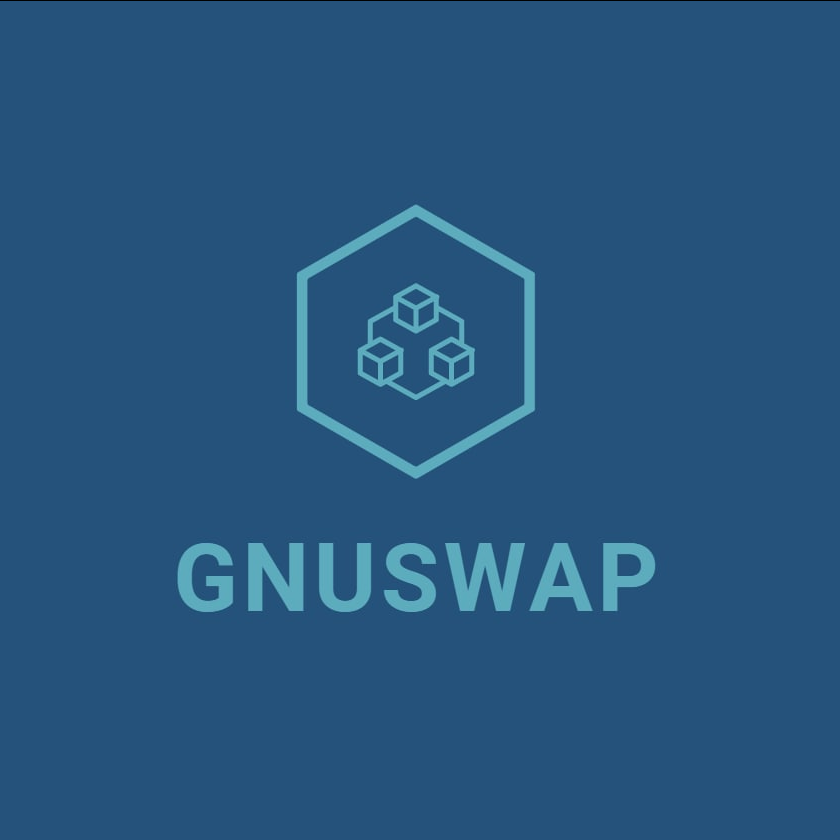

<h1 align="center">gnuswap</h1>
gnuswap is an Gnosis Safe App to exchange token across multiple chains. Gnosis safe is a widely used application by companies, asset holders as it helps in managing asset owned by multiple stakeholders by levarages multisig capabilities of the gnosis safe. It helps transfer assets easily within the safe.

## App screen

## Features

* Easy hassle free swapping of tokens cross chain
* Directly integrated with gnosis safe
* Uses Connext to do cross chain swapping

## Why a Gnosis application

* We chose gnosis as it is widely used by many crypto projects to manage assets
* Multi sig features
* It is has an application sdk which can be used to integrate with the wallet
* The gnosis ecosystem is growing and has a lot of good dapps/defi protcols
* It would be very convineant to transfer assets across chains owned by multiple parties
* Infact it was even used for a covid relief campaign in India!

## How we Built it 

We integrated Gnosis Safe using the gnosis safe sdk with connext network widget. 
We utilized the Gnosis UI SDK to keep the elements as native as possible.

## Future Scope

* This allows projects to utilize their tokens and generate returns all from the familiar safe interface.
* Meta-transactions can be added so as to make the process, more seamless
* Specific L2 bridges maybe used inorder to make the transfer more efficient
