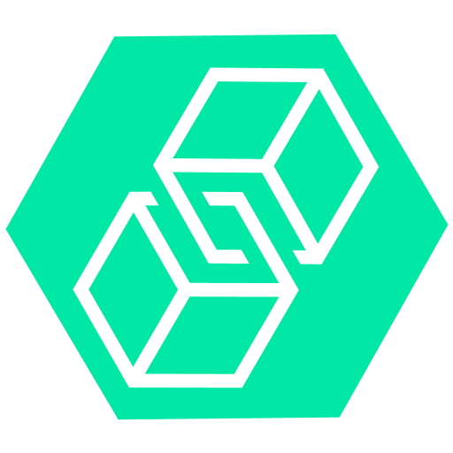

# Disclaimer

Please do your own research and due diligence, the team is not responsible for any loss of funds. If there is a technical issue, we would like to hear of it. 
Please raise a issue in the github issue tracker.

<p align="center">

</p>
<h1 align="center">gnuswap</h1>
gnuswap is an Gnosis Safe App to exchange token across multiple chains. Gnosis safe is a widely used application by companies, asset holders as it helps in managing asset owned by multiple stakeholders by levarages multisig capabilities of the gnosis safe. It helps transfer assets easily within the safe.

gnuswap is powered by the nxtp sdk from connext.network. gnuswap is a simple skin overlay over this sdk.

## URL to use the safe with connext
```
https://gnuswap.vercel.app/
```

## App screen


## Features

- Easy hassle free swapping of tokens cross chain
- Directly integrated with gnosis safe
- Uses Connext to do cross chain swapping
- Currently only supports USDT. It will support other tokens soon after launch.

## Why a Gnosis application


- We chose gnosis as it is widely used by many crypto projects to manage assets
- Multi sig features
- It is has an application sdk which can be used to integrate with the wallet
- The gnosis ecosystem is growing and has a lot of good dapps/defi protcols
- It would be very convineant to transfer assets across chains owned by multiple parties
- Infact it was even used for a covid relief campaign in India!

## How we Built it

We integrated Gnosis Safe using the gnosis safe sdk with connext network nxtp sdk.
We utilized the Gnosis UI SDK to keep the elements as native as possible.


